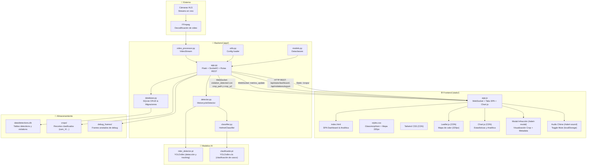
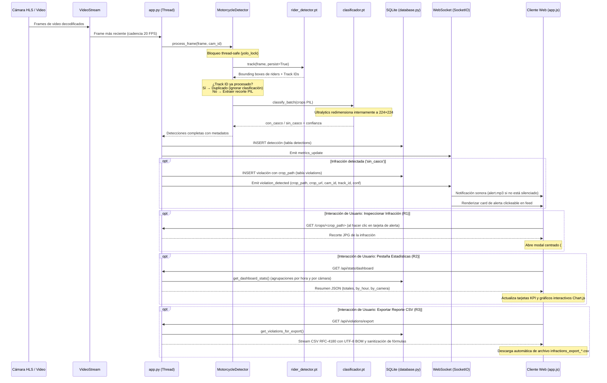

# 🏗️ Arquitectura del Sistema

Documentación técnica de la arquitectura del Sistema de Detección de Cascos en Motociclistas.

---

## 📐 Diagrama de Arquitectura



---

## 📂 Estructura de Archivos

```
final_img/
├── app/                          # Backend Python
│   ├── __init__.py
│   ├── app.py                    # Servidor Flask principal, rutas REST, WebSocket y static crops
│   ├── core/                     # Lógica central de detección y tracking
│   │   ├── __init__.py
│   │   ├── detector.py           # MotorcycleDetector (tracking + clasificación)
│   │   ├── classifier.py         # HelmetClassifier (YOLOv8m-cls)
│   │   ├── video_processor.py    # VideoStream (HLS/archivos locales)
│   │   └── utils.py              # Loader de configuración YAML
│   └── data/                     # Capa de persistencia y datos
│       ├── __init__.py
│       ├── database.py           # SQLite CRUD, migraciones (crop_path), stats y export CSV
│       └── models.py             # Dataclasses: Camera, Detection, Metrics
│
├── static/                       # Frontend SPA
│   ├── index.html                # Interfaz SPA (Monitoreo, Dashboard Chart.js, Modal, Mute)
│   ├── css/                      # Estilos personalizados
│   │   └── styles.css            # Tema oscuro glassmorphic, mapa 220px, responsive
│   ├── js/                       # Lógica del cliente
│   │   └── app.js                # WebSockets, Leaflet, Chart.js, modal, audio y CSV
│   └── audio/                    # Recursos de audio
│       └── alert.mp3             # Chime sutil de notificación sonora
│
├── config/
│   └── config.yaml               # Configuración central del sistema
│
├── docs/                         # Documentación técnica
│   ├── ARQUITECTURA.md           # Arquitectura del sistema, endpoints y flujos (este documento)
│   ├── GUIA_ENTRENAMIENTO.md     # Guía para entrenamiento y export de modelos
│   ├── DEPENDENCIAS.md           # Lista de dependencias y versiones
│   └── GUIA_INSTALACION.md       # Guía paso a paso de instalación
│
├── tests/                        # Suite de pruebas E2E por niveles (Tiers 1-4)
│   ├── run_tests.py              # Runner de pruebas automatizadas E2E
│   ├── test_tier1_features.py    # Pruebas funcionales de requisitos R1 a R5
│   ├── test_tier2_boundaries.py  # Pruebas de condiciones de borde y robustez
│   ├── test_tier3_combinations.py# Pruebas de combinaciones entre módulos
│   └── test_tier4_scenarios.py   # Pruebas de escenarios de uso real
│
├── rider_detector.pt             # Modelo YOLOv8m para detección de riders (~52 MB)
├── clasificador.pt               # Modelo YOLOv8m-cls para clasificación de casco (~31 MB)
├── evaluar_video.py              # Script offline para procesamiento por lotes de videos
├── requirements.txt              # Dependencias Python
├── data/detections.db            # Base de datos SQLite
├── crops/                        # Recortes organizados por cámara y clasificación
├── debug_frames/                 # Frames de depuración con bboxes anotadas
└── README.md                     # Guía rápida de uso, API y testing
```

---

## 🔄 Pipeline de Procesamiento y Flujos de Usuario



---

## 🧠 Componentes Principales

### 1. `app.py` — Servidor Flask y Endpoints

| Responsabilidad | Detalle |
|----------------|---------|
| Servidor HTTP | Flask escuchando en `0.0.0.0:5000` (CORS habilitado) |
| Servidor WebSocket | Flask-SocketIO para eventos en tiempo real |
| Procesamiento Concurrente | Un hilo de ejecución (`threading.Thread`) por cámara activa |
| Sincronización y Seguridad | `threading.Lock()` para inferencia YOLO y protección contra path traversal |
| Servidor Estático de Recortes | Entrega de imágenes de infracciones desde `crops/` |

#### API REST

- `GET /` — Retorna la aplicación de página única (SPA `index.html`).
- `GET /crops/<path:filename>` — **(Nuevo en M1/M3)** Sirve recortes de infracciones almacenados en el directorio de `crops/`. Valida de forma estricta contra ataques de directory traversal mediante `send_from_directory`.
- `GET /api/stats/dashboard` (alias: `/api/dashboard/stats`) — **(Nuevo en M1/M3)** Retorna métricas consolidadas para el dashboard analítico y gráficos Chart.js:
  ```json
  {
    "success": true,
    "status": "ok",
    "summary": {
      "total_violations": 42,
      "total_detections": 150,
      "compliance_rate": 72.0
    },
    "total_violations": 42,
    "total_detections": 150,
    "compliance_rate": 72.0,
    "by_camera": [
      {"camera_id": 1, "camera_name": "Av. Corrientes", "violations": 25, "detections": 90},
      {"camera_id": 2, "camera_name": "Av. 9 de Julio", "violations": 17, "detections": 60}
    ],
    "by_hour": [
      {"hour": "08:00", "violations": 5},
      {"hour": "09:00", "violations": 12}
    ]
  }
  ```
- `GET /api/violations/export` (alias: `/api/reports/csv`) — **(Nuevo en M1/M3)** Genera y descarga un reporte en formato CSV compatible con RFC-4180:
  - Header HTTP: `Content-Type: text/csv; charset=utf-8` y `Content-Disposition: attachment; filename="infractions_export_<timestamp>.csv"`.
  - Encoding: Incluye UTF-8 BOM (`\ufeff`) para compatibilidad directa con Microsoft Excel en Windows.
  - Columnas: `id,timestamp,datetime,camera_id,camera_name,helmet_status,confidence,helmet_confidence,image_path`.
  - Protección de seguridad: Los campos que inician con `=`, `+`, `-`, o `@` son prefijados con comilla simple (`'`) para prevenir inyección de fórmulas en hojas de cálculo.
  - Filtro opcional: Parámetro de query `?camera_id=<id>`.
- `GET /api/cameras` — Lista de cámaras registradas (filtrable por `?mode=live` o `?mode=file`).
- `POST /api/start` — Inicia el procesamiento en lote (`{ "mode": "live" | "file" }`).
- `POST /api/stop` — Detiene la ejecución de todos los threads y limpia el estado activo.
- `GET /api/metrics/<time_range>` — Métricas agregadas por ventana de tiempo (`5min`, `15min`, `30min`, `1hour`).
- `GET /api/map/heatmap` — Datos geoespaciales agregados para el mapa de calor Leaflet.
- `GET /api/violations` — Historial en JSON de las infracciones más recientes (límite 50).
- `GET /videos/<path:filename>` — Streaming de archivos locales para el modo archivo.

#### Eventos WebSocket (SocketIO)

- `violation_detected` — Emitido cuando un motociclista es clasificado `sin_casco`. Payload enriquecido:
  ```json
  {
    "type": "sin_casco",
    "confidence": 0.89,
    "timestamp": 1725464500.12,
    "camera_id": 1,
    "camera_name": "Av. Corrientes",
    "track_id": 4,
    "crop_path": "cam_1/sin_casco/moto_t1725464500_4.jpg",
    "crop_url": "/crops/cam_1/sin_casco/moto_t1725464500_4.jpg",
    "bbox": [320, 140, 510, 480]
  }
  ```
- `metrics_update` — Emitido en cada ciclo con las métricas acumuladas de la cámara.
- `camera_finished` — Notifica la finalización de video de una cámara individual.
- `all_cameras_finished` — Notifica cuando todas las cámaras han completado su stream.

---

### 2. Frontend y Capacidades UI/UX

El frontend está implementado como una Single Page Application (SPA) responsiva y moderna:

1. **Modal de Alertas Interactivo (`#alert-modal`) (R1 / F10–F15):**
   - Las tarjetas de alerta en `#alerts-container` son interactivas (cursor pointer, efectos hover).
   - Al hacer clic, se abre un diálogo modal centrado con fondo desenfocado (`backdrop-blur-md`).
   - Muestra la imagen del infractor obtenida desde `crop_url` (`/crops/...`), con respaldo gráfico (fallback elegante) si la imagen no existiera en el servidor.
   - Presenta un panel de metadatos con hora exacta, cámara de origen, estado de infracción y porcentaje de confianza.
   - Accesibilidad y control de cierre: botón 'X', clic en el fondo exterior (`backdrop`), o presión de la tecla `Escape`.

2. **Notificaciones Sonoras y Botón Mute (`#btn-audio-toggle`) (R4 / F16–F19):**
   - Reproduce un chime de alerta sutil (`static/audio/alert.mp3`) cada vez que se emite `violation_detected`.
   - Botón en la barra superior para alternar entre sonido activado (🔔) y silenciado (🔕).
   - El estado de preferencia de audio se persiste automáticamente en `localStorage` del navegador.
   - Manejo de restricciones de autoplay de navegadores modernos mediante inicialización en la primera interacción del usuario.

3. **Optimización del Mapa Leaflet (`#map`) (R5 / F20–F21):**
   - Altura del contenedor `#map` ajustada a **220px** en `static/css/styles.css` (reducida desde 350px), permitiendo una convivencia ergonómica junto a la cuadrícula 2x2 de video sin generar scroll vertical excesivo.
   - Invocación de `leafletMap.invalidateSize()` al conmutar pestañas o redimensionar pantalla para recalcular dinámicamente las teselas del mapa sin artefactos visuales.

4. **Pestaña SPA de Estadísticas y Analítica (`#dashboard-view`) (R2 / F22–F26):**
   - Navegación de pestañas integrada en el encabezado ("Monitoreo en Vivo" y "Estadísticas / Analítica").
   - Conmutación instantánea mediante manipulación de clases sin recarga de navegador.
   - Tarjetas KPI: **Infracciones Totales** (`#stat-total-violations`), **Total Detecciones** (`#stat-total-detections`), y **Tasa de Cumplimiento** (`#stat-compliance-rate`).
   - Dos gráficos interactivos con Chart.js:
     - *Infracciones por Hora* (`#chart-hourly`): Gráfico de barras que representa la distribución temporal de infracciones.
     - *Infracciones por Cámara* (`#chart-camera`): Gráfico comparativo según el punto de captura.

5. **Exportación de Reporte CSV (`#btn-export-csv`) (R3 / F27):**
   - Botón directo en la vista de Analítica para descargar el histórico de infracciones en formato CSV.
   - Manejo de estados de carga (spinner y texto de espera) mientras se genera el reporte.

---

### 3. `detector.py` — MotorcycleDetector

Implementa la arquitectura en dos etapas siguiendo la filosofía KISS:

1. **Detección y Tracking Persistente:**
   - Modelo: `rider_detector.pt` (YOLOv8m entrenado sobre ~12,400 imágenes de riders).
   - Inferencia con tracking persistente: `track(frame, persist=True)`.
   - Asigna un `track_id` único a cada rider (motocicleta + conductor).

2. **Deduplicación:**
   - Cada `track_id` se clasifica exactamente una vez durante su trayectoria en escena.
   - Evita conteo redundante y saturación de procesamiento.

3. **Clasificación de Casco:**
   - Se extrae el recorte PIL del rider.
   - Se entrega directamente a `clasificador.pt` (YOLOv8m-cls), dejando que Ultralytics gestione internamente el redimensionamiento a 224×224 sin doble redimensionado manual.

---

### 4. `classifier.py` — HelmetClassifier

- Wrapper sobre el modelo YOLOv8m-cls (`clasificador.pt`).
- Clases de salida: `sin_casco` (clase 0) y `con_casco` (clase 1).
- Soporte para inferencia en lotes (`classify_batch`) garantizando baja latencia.

---

### 5. `video_processor.py` — VideoStream

- Desacoplamiento de captura y análisis mediante cola de frames en hilo secundario.
- Soporta transmisiones HLS vía FFmpeg y archivos locales de video MP4/MKV.
- Cadencia de procesamiento: 20 frames por segundo (`process_interval: 0.05` en `config.yaml`).

---

### 6. `database.py` — Persistencia SQLite

Estructura de la base de datos `data/detections.db`:

```sql
CREATE TABLE IF NOT EXISTS detections (
    id INTEGER PRIMARY KEY AUTOINCREMENT,
    timestamp REAL NOT NULL,
    datetime TEXT NOT NULL,
    bbox TEXT NOT NULL,
    class_name TEXT NOT NULL,
    confidence REAL NOT NULL,
    helmet_status TEXT,
    helmet_confidence REAL,
    camera_id INTEGER DEFAULT 0
);

CREATE TABLE IF NOT EXISTS violations (
    id INTEGER PRIMARY KEY AUTOINCREMENT,
    timestamp REAL NOT NULL,
    datetime TEXT NOT NULL,
    bbox TEXT NOT NULL,
    confidence REAL NOT NULL,
    helmet_confidence REAL,
    camera_id INTEGER DEFAULT 0,
    crop_path TEXT
);
```

- Migración automática: En caso de tablas preexistentes, ejecuta `ALTER TABLE` para garantizar las columnas `camera_id` y `crop_path`.
- Consultas analíticas:
  - `get_dashboard_stats(cameras_list)`: Agregación SQL con `strftime('%H:00', datetime)` para agrupamiento horario y conteos por cámara.
  - `get_violations_for_export(camera_id=None)`: Extracción de registros ordenados temporalmente para generación de CSV.

---

## 🗃️ Modelos de Inteligencia Artificial Activos

| Modelo | Archivo | Base | Propósito | Resolución Entrada |
|--------|---------|------|-----------|--------------------|
| **Detector de Riders** | `rider_detector.pt` | YOLOv8m | Detección y tracking de motociclistas como una unidad | 640×640 |
| **Clasificador de Cascos** | `clasificador.pt` | YOLOv8m-cls | Clasificación binaria (`sin_casco` / `con_casco`) | 224×224 |

> [!NOTE]
> El sistema cumple estrictamente la directiva KISS: no se emplean modelos obsoletos (como `yolov8x.pt`), ni detectores secundarios superfluos, ni pipelines descartados de similitud.

---

## 🔧 Configuración (`config/config.yaml`)

| Sección | Parámetro | Valor por defecto | Descripción |
|---------|-----------|-------------------|-------------|
| `models.detection` | `rider_detector.pt` | — | Path al modelo YOLOv8m detector |
| `models.classification` | `clasificador.pt` | — | Path al clasificador YOLOv8m-cls |
| `detection.confidence_threshold` | `0.40` | — | Confianza mínima para registrar un rider |
| `detection.process_interval` | `0.05` | segundos | Cadencia base de análisis (20 FPS) |
| `classification.confidence_threshold` | `0.70` | — | Confianza mínima de clasificación de casco |
| `classification.imgsz` | `64` | píxeles | Dimensión de imagen esperada por el clasificador |
| `server.host` | `0.0.0.0` | — | Interfaz de red de escucha del servidor |
| `server.port` | `5000` | — | Puerto HTTP del servidor Flask |
| `paths.crops_dir` | `crops` | — | Carpeta de almacenamiento de recortes JPG |

---

## 🌐 Tecnologías y Bibliotecas

| Componente | Tecnología | Versión / Tipo | Rol en el Sistema |
|-----------|-----------|----------------|-------------------|
| Backend Web | Flask | 3.0.0 | Servidor HTTP REST y serving de archivos estáticos |
| Tiempo Real | Flask-SocketIO | 5.3.5 | WebSocket para telemetría y alertas en vivo |
| Framework IA | Ultralytics YOLOv8 | 8.1.0+ | Inferencia de detección, tracking y clasificación |
| Motor Deep Learning | PyTorch | 2.0+ | Backend de tensores y aceleración GPU |
| Visión por Computadora | OpenCV | 4.10+ | Decodificación y manipulación de matrices de imagen |
| Base de Datos | SQLite3 | Estándar Python | Almacén transaccional local |
| Estilos UI | Tailwind CSS | CDN | Maquetación y componentes visuales responsivos |
| Mapas Interactivos | Leaflet.js | 1.9.4 | Mapa oscuro y capa Leaflet.heat (altura 220px) |
| Analítica Visual | Chart.js | CDN | Gráficos de barras y comparativas en pestaña Estadísticas |
| Streaming | FFmpeg + HLS.js | Última estable | Transcodificación y reproducción de video HLS |
| Tipografía | Inter | Google Fonts | Tipografía moderna de alta legibilidad |
